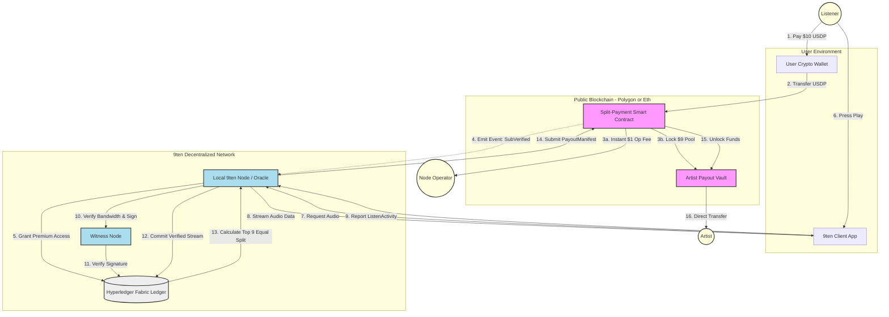

Here is the complete, fully assembled specification in a single Markdown block. You can copy/paste this directly into your `README.md`.

---

```markdown
# 9ten - A Decentralized Music Streaming Platform

## Introduction and Vision

**Purpose**
9ten is a decentralized music streaming platform leveraging peer-to-peer data sharing technologies and the W3C ActivityPub protocol to create a social network for artists and fans. The platform enables listeners to pay an optional monthly subscription fee, which is fairly and transparently distributed to their top 9 most-listened-to artists each month.

**Vision Statement**
To revolutionize the music streaming industry by fostering a fair, transparent, and decentralized ecosystem that empowers artists and engages listeners. Our goal is to create a platform where the needs and rights of artists and listeners take precedence over large conglomerates, utilizing a hybrid architecture of public blockchains for payments and private ledgers for data integrity.

## Core Principles

1.  **Fair Compensation:** Artists are paid directly based on verified listener engagement, not obscure pro-rata pools.
2.  **Decentralization of Power:** No central authority controls the content or the money flow.
3.  **Transparency in Operations:** All stream verifications and payouts are auditable.
4.  **Artist Empowerment:** Artists own their data and relationships with fans.
5.  **Listener Engagement:** Listeners directly support the specific artists they consume.
6.  **Trustless Architecture:** Node operators verify data but do not hold custody of artist funds.

## Stakeholder Overview

### Roles and Responsibilities
-   **Developers:** Implement and maintain the technical aspects of the platform, including ActivityPub integration, Hyperledger Fabric setup, and Smart Contract bridges.
-   **Artists:** Upload music, engage with fans, and **link a valid crypto wallet** to their profile to receive automated direct payouts.
-   **Server Admins (Node Operators):** Set up and manage 9ten server instances. **They do not hold custody of artist funds.** They receive their operating revenue ($1/user) instantly via smart contract when a user subscribes.
-   **Listeners:** Use the platform to stream music, support artists, and interact with content via USDP subscription payments.

### Stakeholder Benefits
-   **Developers:** Opportunity to work on cutting-edge technologies and contribute to an innovative project.
-   **Artists:** Fair compensation, direct engagement with fans, and control over their content.
-   **Server Admins:** Regular, automated revenue from listener subscriptions without tax liability for artist pools.
-   **Listeners:** Directly support favorite artists and enjoy high-quality, decentralized streaming.

## Technical Overview

### Architecture Logic
9ten utilizes a **Hybrid Ledger Architecture**:
1.  **ActivityPub (Forked PeerTube):** Handles social interactions, federation, and heavy media streaming.
2.  **Hyperledger Fabric:** A private, permissioned ledger for high-speed, zero-gas logging of "Listen Activities" and subscription status.
3.  **Public Blockchain (Polygon/Ethereum):** Handles the actual movement of USDP funds via Smart Contracts to ensure trustlessness.

### Data Flow Diagram



## The Financial Model: Trustless USDP Bridge

To ensure **Node Operators are not liable** for artist payouts (avoiding "money transmitter" status), 9ten utilizes a **Split-Payment Smart Contract**.

### 1. Subscription Logic

* **Listener Payment:** The user sends **$10 USDP** to the 9ten Smart Contract.
* **The Split:**
* **$1.00 USDP** is sent immediately to the **Node Operator's Public Wallet** (Operational Fee).
* **$9.00 USDP** is locked in the **Artist Payout Vault** (Smart Contract).


* **Access Grant:** The Smart Contract emits a `SubscriptionVerified` event. The local 9ten Node (acting as an Oracle) detects this and grants the user 30 days of "Premium" access on the Hyperledger Fabric network.

### 2. The "Top 9" Payout Protocol

Funds are distributed based on an **Equal Weight Protocol**. On the 25th of every month, the Hyperledger Chaincode executes the following logic:

1. **Aggregation:** Query all verified `ListenActivity` logs for User U.
2. **Ranking:** Sort artists by total listening duration.
3. **Selection:** Select the top N artists (where N \le 9).
4. **Calculation:**
* The User's Pool P = \$9.00.
* Payout per Artist = P / N.
* *Example:* If a user listens to 50 artists, the top 9 each receive **$1.00**. If a user listens to only 3 artists, each receives **$3.00**.


5. **Execution:** The Node submits a `PayoutManifest` to the public Smart Contract, which unlocks the funds and transfers them directly to the Artists' wallets.

## Detailed Technical Implementation

### Extending ActivityPub for Streaming

We are forking **PeerTube** to leverage its federation capabilities, stripping video-specific transcoding and replacing it with high-fidelity audio handling.

#### Custom Objects

We extend the standard ActivityStreams vocabulary to support rich audio metadata.

```json
{
  "@context": "[https://www.w3.org/ns/activitystreams](https://www.w3.org/ns/activitystreams)",
  "type": "Audio",
  "name": "Track Title",
  "artist": "Artist Name",
  "duration": "PT3M30S",
  "ethereumWallet": "0xArtistWalletAddress..." 
}

```

#### Custom Activities

* `ListenActivity`: Represents a user listening to a track.
* `StreamActivity`: Represents live streaming events.
* `SubscriptionActivity`: Represents subscribing to an artist or node.

### Integrating Hyperledger for Transactions

#### Hyperledger Fabric Setup

1. **Nodes:** Each ActivityPub server also runs a Hyperledger Fabric peer.
2. **Chaincode:**
* **Subscription Status:** Reads events from the public blockchain Oracle.
* **Streaming Rewards:** Calculates the "Top 9" split.
* **Transaction Verification:** Implements the "Three Eyes" policy.


### Dispute Resolution: The "Three Eyes" Policy

To prevent "fake streams" (sybil attacks), every stream must satisfy three checks before being written to the Ledger:

1. **The Reporter:** The user's client cryptographically signs the start/stop report.
2. **The Host:** The node hosting the file validates that bandwidth was actually consumed.
3. **The Witness:** A random peer node in the cluster verifies the cryptographic signature of the packet.

Only when all three signatures are present is the `ListenActivity` committed to Hyperledger Fabric.

## Non-Technical Aspects

### Community and Governance

1. **Community Guidelines:** Establish guidelines for community interaction and contribution.
2. **Governance Model:** Define how decisions are made, who has voting rights, and how conflicts are resolved (DAO structure for future consideration).

### Marketing and Outreach

1. **Strategy:** Attract early artists by offering 100% of their "Top 9" pool (minus only gas fees).
2. **Partnerships:** Potential partnerships with indie artist collectives and Web3 music aggregators.

## Security and Privacy

### Data Privacy

* **Anonymization:** User listening history is stored on the private Hyperledger channel, accessible only to the user and the specific nodes required for payout verification.
* **Federation:** Social interactions (likes, follows) are public via ActivityPub, but financial data is private.

### Security Measures

* **Smart Contract Audits:** All solidity code for payment bridges must be audited.
* **Permissioned Ledger:** Only authorized nodes can write to the Hyperledger instance, preventing spam and DoS attacks common on public chains.
* **Identity Management:** Users maintain two identities—an ActivityPub handle for social and a Wallet Address for finance—linked securely via the client.

## Roadmap and Milestones

### Phase 1: Core Architecture

* Fork PeerTube and implement `Audio` object types.
* Set up Hyperledger Fabric testnet.

### Phase 1.5: The Bridge Prototype

* Develop Solidity Smart Contract for the "Split-Payment" logic ($10 in -> $1 Op / $9 Vault).
* Build the Oracle service that listens for blockchain events to update Hyperledger user statuses.

### Phase 2: The "Three Eyes" Consensus

* Implement the multi-signature verification for stream reporting.
* Develop the "Top 9" calculation Chaincode.

### Phase 3: Public Beta

* Launch on Polygon Mainnet (for low gas fees).
* Onboard initial artist collective.

### Metrics for Success

* Number of active nodes.
* Total USDP distributed to artists.
* Number of verified streams per month.

## Appendices

### Glossary

* **USDP:** Paxos Standard or similar USD-pegged stablecoin.
* **ActivityPub:** A decentralized social networking protocol.
* **Hyperledger Fabric:** A permissioned blockchain infrastructure.

### References

* W3C ActivityPub Specification.
* Hyperledger Fabric Documentation.
* PeerTube Documentation.

### Frequently Asked Questions (FAQ)

* **Q:** What if I listen to less than 9 artists?
* **A:** Your $9 pool is split equally among however many artists you listened to. If you listened to 3, they get $3 each.


* **Q:** Do node operators hold my money?
* **A:** No. Your subscription payment goes to a Smart Contract. Node operators only receive their $1 fee; the rest is locked until the payout date.


```

```
